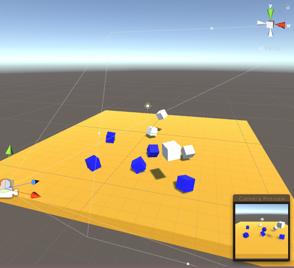
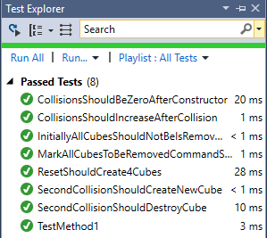
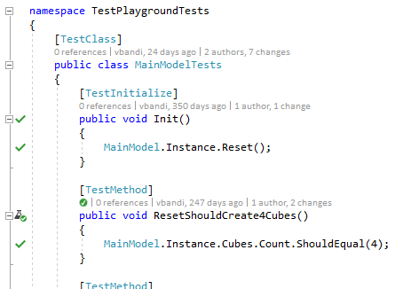
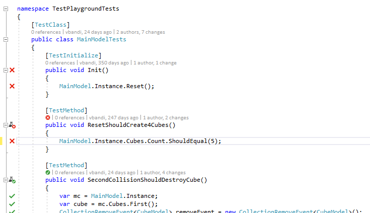

# Overview
MVP Toolkit for Unity is an implementation of the Model-View-Presenter pattern for Unity. It is inspired by XAML-based frameworks, where separation of a testable business logic and a declarative presentation layer using the similar MVVM pattern is a well established and widely used practice.

# Goals
* Provide a clean separation between business logic and presentation
* Allow the business logic to be testable outside of Unity, enabling unit test integration with build servers, super fast unit testing, or even live unit testing (unit testing as you type) in tools such as Visual Studio.
* Be lightweight, so that you only have a few concepts to learn
* Doesn't force you to use it - adapt for just a small module, or as you see fit. 
* Unity is being used more and more for Line of Business applications, especially in the AR and VR space. The game engine origins of Unity are not a good fit to LOB applications, and more importantly, it needs an architecture that allows for more enterprise-y thinking and developer approach. However, MVP Toolkit for Unity is not just for business app developers. We believe that the practices it enables ultimately can benefit game developers, too.
# MVP??
MVP stands for Model-View-Presenter. To be honest, I am not 100% sure that this is the proper scientific term for what I am doing here. Let me know if you think otherwise.

## The Model
The Model contains all the data the business logic is working with - and also all the business logic. So, what kind of data is stored in models? If you're writing a game, a good rule of thumb is that it is the data that you need to create a save that you can use to restore the game exactly where the user has left off. So, things like health, position of objects, progress all belong to the model, while things that don't directly effect gameplay, such as the precise position of smoke particles do not.

An important thing about models is that it is independent of Unity. Models don't know anything about GameObjects, Scenes, Lighting, Physics and so on. Models are all about data and logic. It is a deeper  abstraction level.

For example, the health of the player is stored in the model. The amount of damage an enemy inflicts on the player is also stored in the model. The model's Player object has a Player.Damage(int damage) method, which subtracts the damage from the player's health and determines whether the player is just hurt or is killed. But the visual representation of the health bar belongs to the Presenter and the View. So are any additional effects you may want to associate with health (making the screen red on low health, or playing a heartbeat, etc).

*Note: some MVP implementations put this kind of logic in the Presenter and only use the Model for storing data. The MVP Toolkit for Unity approach is different: business logic is implemented in the Model level, because the Model is independent of Unity and thus external test runners can run tests on the Model.*

## The View
The Views are Unity GameObjects. Prefabs, cameras, 3D primitives, etc. Simple. 

## Presenter
The Presenter is the glue layer between the View and the Model. Remember, the Model doesn't know a thing about GameObjects or Unity. The Presenter is a descendant of the PresenterBase class of the MVP Toolkit, which in turn inherits from MonoBehaviour. 

The Presenter understands changes in the model and reflects those changes in the View. This means that The Presenter also receives Unity events, such as collisions, input, etc - and notifies the Model in case the Model has to know about it. If an event is purely cosmetic and can be kept on the presenter level (e.g. a "button pressed" animation is finished), there's no need to forward it to the Model.

# UniRX
MVP Toolkit for Unity is building heavily upon [UniRX](https://github.com/neuecc/UniRx). In fact, UniRX is what makes the MVP Toolkit light on plumbing code. UniRX implements most of the key components for the MVP architecture, and is one of the giants whose shoulders MVP Toolkit for Unity stands upon. I highly recommend taking the time and understanding the following UniRX concepts:
* [The introduction to Reactive Programming you've been missing](https://gist.github.com/staltz/868e7e9bc2a7b8c1f754)
* ReactiveProperty
* ReactiveCollection
* MonoBehaviour Triggers 

# So What is in the MVP Toolkit for Unity?
Right now, apart from a demo app to illustrate the architecture, it only contains 3 classes:

## PresenterBase
A base class for all presenters, inherited from GameObject. It is a generic class, specifying the type of the Model it belongs to in its generic parameter:

```CSharp
public class PresenterBase<T> : MonoBehaviour 
{
    public T Model;
}
```

## SingletonPresenterBase
A singleton PresenterBase with an `Instance` property for easy access.

## BoundItemsContainer
If you have Models in a `ReactiveCollection`, this class can create a binding between the collection and the View. Whenever you add a model to the collection, `BoundItemsContainer` creates a corresponding GameObject. Also, when you remove a model from the collection, `BoundItemsContainer` removes the GameObject from the Hierarchy (if `DestroyOnRemove` is true).

The type of the model is set by the generic parameter of the `BoundItemsContainer` class. 

### BoundItemsContainer Constructor
```CSharp
public BoundItemsContainer(GameObject itemPrefab, GameObject itemHolder)
```
The first step is to instantiate the class, providing prefab to be created for every model added to the collection and the container in the scene hierarchy under which the prefab will be added.

The `itemPrefab` prefab should have a `PresenterBase` attached to it. `BoundItemsContainer` will take care of setting the `Model` field of the `PresenterBase`.


### DestroyOnRemove
If this is set to true, `BoundItemsContainer` automatically destroys the corresponding GameObject belonging to the Model removed from the collection.

### ObserveAdd and ObserveRemove
Provides means for you to observe when an object has been added or removed to the underlying collection and a prefab has been created or destroyed. This allows you to have additional code ran in these situations, initializing the view and the presenter. 

### BoundItemsContainer.Initialize
```CSharp
public Initialize(ReactiveCollection<T> collectionToBindTo)
```

After you've set the above properties, call `Initialize` to provide the `ReactiveCollection` that the `BoundItemsContainer` will bind to. You can only call `Initialize` once per `BoundItemsContainer` instance. 
Calling `Initialize` will enumerate through any existing items in the provided collection, and publish to `ObserveAdd` so that you have a chance to change how the initial presenters are created.

# Runninng the Sample App
To run the sample app, clone this repository, and open it in Unity 2018.1 beta. Press the play button. 

The sample app has the following features:
* White cubes are falling on a yellow floor and bouncing off of it and each other
* Every cube turns to blue on the second collision
* Blue cubes are no longer affected by physics, and deleted 2 seconds after they have turned blue
* There are always 4 inactive in the scene. No more, no less.
* Double clicking the mouse will turn all cubes into blue. These cubes will remain active until the second collision.



## Execute Unit Tests on the Sample App
The sample app should have at least the following projects in the solution:
* TestableUnity
* TestableUnity.Plugins (contains UniRx)
* TestPlaygroundTests

You may have additional projects depending on the platform specified in Unity.

To execute the tests in Visual Studio 2017, Select Test/Run/All Tests in the menu. After a short compiling, you should see something similar to this in the Test Explorer:



If you have Visual Studio 2017 Enterprise, you can also use [Live Unit Testing](https://blogs.msdn.microsoft.com/visualstudio/2017/03/09/live-unit-testing-in-visual-studio-2017-enterprise/). It allows you to execute tests as you type, and to be honest, one of the main motivators to create MVP Toolkit for Unity is to be able to take advantage of Live Unit Testing. It is seriously a game changer.

To see Live Unit Testing in action, open a test, such as MainModelTests.cs. Select Test/Live Unit Testing/Start. After a short compilation, you should see something like this:



The green checkmarks indicate lines of code that have been touched by a passing test. If you change something in the test, like replace the 4 with a 5, some of the green checkmarks turn into scary red crosses after a few seconds! Note that you don't even have to save your file for this. Just type, and the computer compiles in the background automatically, and runs the tests affected by your code change (and only those).



Note that some of the tests at the bottom are still green. Our change has not affected those tests.

# Using MVP Toolkit for Unity in Your Own App
To use MVP Toolkit for Unity in your own app, you'll need to add UniRX and the contents of the Assets/MVPToolkit folder to your app. You can also find UniRX in the Asset Store.

# Feedbacks are More Than Welcome!
Got thoughts, feedback, enhancements to share? Bugs to report? I'd be more than happy to hear from you! One of the main reasons I'm sharing this is to get more eyeballs on this approach, and discuss it with people from different background and experience than mine. So, please download it, and let me know what you think!

András "vbandi" Velvárt